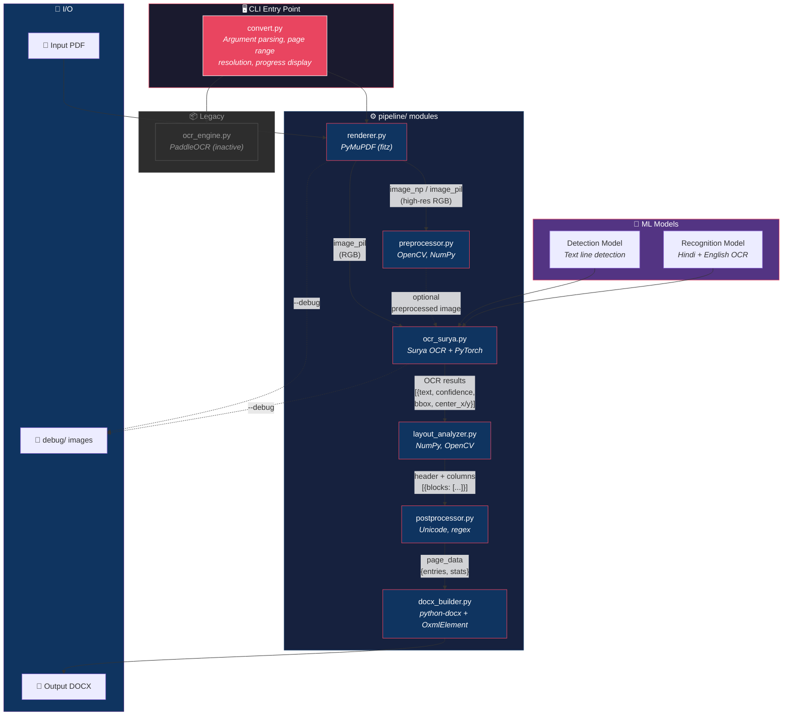

# Hindi Dictionary PDF → DOCX Converter

A command-line tool to convert Hindi scientific/technical dictionary PDFs into editable DOCX files using OCR. Bypasses broken PDF font encodings by rendering pages as high-resolution images and reading them with [Surya OCR](https://github.com/VikParuchuri/surya).

---

## Table of Contents

- [Features](#features)
- [Architecture](#architecture)
- [Complete System Flow](#complete-system-flow)
- [Prerequisites](#prerequisites)
- [Clone the Repository](#clone-the-repository)
- [Installation (Step-by-Step)](#installation-step-by-step)
  - [Windows](#windows)
  - [macOS / Linux](#macos--linux)
  - [GPU Support (Optional)](#gpu-support-optional)
- [How to Convert a PDF to DOCX](#how-to-convert-a-pdf-to-docx)
  - [Basic Conversion](#basic-conversion)
  - [Advanced Options](#advanced-options)
- [CLI Arguments Reference](#cli-arguments-reference)
- [Output Formats](#output-formats)
- [Debug Mode](#debug-mode)
- [Project Structure](#project-structure)
- [Troubleshooting](#troubleshooting)
- [License](#license)

---

## Features

- **OCR-based conversion** — reads rendered pixels, bypasses broken Unicode mapping in PDFs
- **Hindi + English support** — Surya OCR handles both Devanagari and Latin scripts
- **2-column layout detection** — automatically splits dictionary columns
- **Structured output** — formatted Word document with proper layout
- **GPU acceleration** — uses NVIDIA CUDA for faster processing (optional)
- **Debug mode** — saves preprocessed images and OCR bounding box visualizations

---

## Architecture

The converter is built as a modular pipeline where each stage transforms data and passes it to the next. The orchestrator (`convert.py`) drives the entire flow.



### Module Responsibilities

| Module | Input | Output | Key Libraries |
|--------|-------|--------|---------------|
| **renderer.py** | PDF file path + page number | High-res RGB image (NumPy + PIL) | PyMuPDF |
| **preprocessor.py** | Raw RGB image | Cleaned grayscale/binary image | OpenCV, NumPy |
| **ocr_surya.py** | PIL image + loaded models | List of `{text, confidence, bbox}` dicts | Surya OCR, PyTorch |
| **layout_analyzer.py** | OCR results + image dimensions | Header dict + column list | NumPy |
| **postprocessor.py** | Header + columns | Structured entries with stats | `unicodedata`, `re` |
| **docx_builder.py** | All page data + output path | Formatted `.docx` file | python-docx |

---

## Complete System Flow

This diagram traces the full execution path from CLI invocation to final DOCX output, including all decision branches and error handling.

```mermaid
flowchart TD
    START(["🚀 python convert.py input.pdf"]) --> PARSE["Parse CLI Arguments<br/><i>argparse: input, --output, --dpi,<br/>--pages, --columns, --format,<br/>--debug, --verbose</i>"]

    PARSE --> VALIDATE{"Input PDF<br/>exists?"}
    VALIDATE -- "No" --> ERR1["❌ ERROR: File not found<br/>sys.exit(1)"]
    VALIDATE -- "Yes" --> BANNER["Print Banner<br/><i>Hindi Dictionary PDF → DOCX Converter</i>"]

    BANNER --> PAGECOUNT["renderer.get_page_count(pdf)<br/><i>Open PDF with PyMuPDF,<br/>return len(doc)</i>"]

    PAGECOUNT --> PARSEPAGES["parse_pages(page_spec, total)<br/><i>Convert '1-5', '1,3,7' to<br/>0-indexed page list</i>"]

    PARSEPAGES --> VALIDPAGES{"Valid pages<br/>to process?"}
    VALIDPAGES -- "No" --> ERR2["❌ ERROR: No valid pages<br/>sys.exit(1)"]
    VALIDPAGES -- "Yes" --> PRINTCONFIG["Print Configuration<br/><i>Input, Output, Pages,<br/>DPI, Format, Debug</i>"]

    PRINTCONFIG --> DEBUGDIR{"--debug<br/>flag?"}
    DEBUGDIR -- "Yes" --> MKDEBUG["os.makedirs('debug/')"]
    DEBUGDIR -- "No" --> LOADMODELS
    MKDEBUG --> LOADMODELS

    LOADMODELS["⏳ Load Surya OCR Models<br/><i>Detection model + processor<br/>Recognition model + processor<br/>(~1.5 GB, cached after first run)</i>"]

    LOADMODELS --> PAGELOOP["🔄 FOR each page in pages_to_process"]

    PAGELOOP --> RENDER["renderer.render_page(pdf, page, dpi)<br/><i>PDF page → zoom matrix<br/>→ pixmap → NumPy array + PIL Image</i>"]

    RENDER --> DEBUGRAW{"--debug?"}
    DEBUGRAW -- "Yes" --> SAVERAW["Save debug/page_NNN_raw.png"]
    DEBUGRAW -- "No" --> OCR
    SAVERAW --> OCR

    OCR["ocr_surya.run_ocr(image_pil, models)<br/><i>surya_run_ocr() internally:<br/>1. Detect text line bounding boxes<br/>2. Crop detected regions<br/>3. Recognize text per region<br/>4. Return text + confidence + bbox</i>"]

    OCR --> FREEGPU["Free GPU Memory<br/><i>gc.collect() +<br/>torch.cuda.empty_cache()</i>"]

    FREEGPU --> DEBUGOCR{"--debug?"}
    DEBUGOCR -- "Yes" --> SAVEOCR["Save debug/page_NNN_ocr_boxes.png<br/><i>Green boxes = high confidence ≥ 0.7<br/>Red boxes = low confidence < 0.7</i>"]
    DEBUGOCR -- "No" --> LAYOUT
    SAVEOCR --> LAYOUT

    LAYOUT["layout_analyzer.analyze()"]

    LAYOUT --> HEADER["detect_header()<br/><i>Top 6% of page → header zone<br/>Sort blocks left → right<br/>Extract: left_word, page_number, right_word</i>"]

    HEADER --> COLDETECT["detect_columns()"]

    COLDETECT --> FORCECOL{"--columns<br/>forced?"}
    FORCECOL -- "= 1" --> SINGLECOL["Single column<br/><i>All blocks sorted top → bottom</i>"]
    FORCECOL -- "Auto / ≥ 2" --> HISTOGRAM

    HISTOGRAM["Method 1: X-axis Projection Histogram<br/><i>Build density histogram from bbox X-coords<br/>Smooth with kernel (2% width)<br/>Search middle 60% for minimum<br/>Verify gap < 30% of peak density</i>"]

    HISTOGRAM --> HISTOK{"Clear gap<br/>found?"}
    HISTOK -- "Yes" --> SPLITCOLS
    HISTOK -- "No" --> CLUSTERING

    CLUSTERING["Method 2: Center-Point Clustering<br/><i>Analyze center_x distribution<br/>Check left/right halves vs center zone (±15%)<br/>Find largest gap between consecutive centers</i>"]

    CLUSTERING --> CLUSTEROK{"Clusters<br/>detected?"}
    CLUSTEROK -- "Yes" --> SPLITCOLS
    CLUSTEROK -- "No" --> FALLBACK{"--columns<br/>≥ 2?"}
    FALLBACK -- "Yes" --> FORCESPLIT["Force split at page center"]
    FALLBACK -- "No" --> SINGLECOL

    FORCESPLIT --> SPLITCOLS
    SPLITCOLS["Split into Left + Right Columns<br/><i>Assign blocks by center_x vs separator<br/>Sort each column top → bottom</i>"]

    SINGLECOL --> POSTPROCESS
    SPLITCOLS --> POSTPROCESS

    POSTPROCESS["postprocessor.process()"]

    POSTPROCESS --> CLEAN["clean_text_block() per block<br/><i>1. Unicode NFC normalization<br/>2. Fix Hindi spacing (virama + matra)<br/>3. Fix OCR misreads in subject codes<br/>4. Collapse whitespace</i>"]

    CLEAN --> DEDUP["remove_duplicates()<br/><i>IoU-based overlap detection<br/>Keep higher confidence block<br/>Re-sort by position</i>"]

    DEDUP --> ENTRIES["detect_entries()<br/><i>Group blocks into dictionary entries:<br/>• New headword = English + left-edge + not subject code<br/>• Attach subject codes (italic abbreviations)<br/>• Attach Hindi translation (Devanagari script)<br/>• Attach notes (parenthetical text)</i>"]

    ENTRIES --> STATS["Compute Page Stats<br/><i>total_entries, avg_confidence,<br/>low_confidence_count</i>"]

    STATS --> NEXTPAGE{"More<br/>pages?"}
    NEXTPAGE -- "Yes" --> PAGELOOP
    NEXTPAGE -- "No" --> BUILDDOCX

    BUILDDOCX["docx_builder.build_docx()"]

    BUILDDOCX --> PAGESETUP["Page Setup<br/><i>A4 (21cm × 29.7cm)<br/>Margins: 1.8cm L/R, 1.5cm T/B<br/>Font: Times New Roman 9pt (Latin)<br/>Font: Mangal 9pt (Devanagari)</i>"]

    PAGESETUP --> FORMATCHECK{"--format?"}

    FORMATCHECK -- "text (default)" --> TEXTMODE["Text Mode (Two-Column Flow)<br/><i>1. Set w:cols XML for 2 columns + separator line<br/>2. Add Word header (guide words + page #)<br/>3. Write left column entries<br/>4. Insert column break<br/>5. Write right column entries<br/><br/>Each entry:<br/>  bold(English) → tab → italic(Subject) → tab → Hindi</i>"]

    FORMATCHECK -- "table" --> TABLEMODE["Table Mode (3-Column Table)<br/><i>1. Create Word table (3 cols)<br/>2. Header row: dark background<br/>3. Entry rows: alternating shading<br/><br/>Columns:<br/>  English Term | Subject | Hindi Translation</i>"]

    TEXTMODE --> SAVEDOCX
    TABLEMODE --> SAVEDOCX

    SAVEDOCX["doc.save(output_path)<br/><i>Write .docx to disk</i>"]

    SAVEDOCX --> SUMMARY["📊 Print Summary<br/><i>Output path, file size,<br/>pages processed, total entries,<br/>avg confidence, processing time</i>"]

    SUMMARY --> DONE(["✅ Conversion Complete!"])

    style START fill:#e94560,stroke:#fff,color:#fff
    style DONE fill:#2ecc71,stroke:#fff,color:#fff
    style ERR1 fill:#c0392b,stroke:#fff,color:#fff
    style ERR2 fill:#c0392b,stroke:#fff,color:#fff
    style LOADMODELS fill:#533483,stroke:#e94560,color:#fff
    style OCR fill:#533483,stroke:#e94560,color:#fff
    style LAYOUT fill:#0f3460,stroke:#e94560,color:#fff
    style POSTPROCESS fill:#0f3460,stroke:#e94560,color:#fff
    style BUILDDOCX fill:#0f3460,stroke:#e94560,color:#fff
    style PAGELOOP fill:#e94560,stroke:#fff,color:#fff
    style RENDER fill:#0f3460,stroke:#533483,color:#fff
    style FREEGPU fill:#2d2d2d,stroke:#e94560,color:#fff
    style HEADER fill:#16213e,stroke:#0f3460,color:#fff
    style COLDETECT fill:#16213e,stroke:#0f3460,color:#fff
    style HISTOGRAM fill:#16213e,stroke:#0f3460,color:#fff
    style CLUSTERING fill:#16213e,stroke:#0f3460,color:#fff
    style CLEAN fill:#16213e,stroke:#0f3460,color:#fff
    style DEDUP fill:#16213e,stroke:#0f3460,color:#fff
    style ENTRIES fill:#16213e,stroke:#0f3460,color:#fff
    style TEXTMODE fill:#0f3460,stroke:#2ecc71,color:#fff
    style TABLEMODE fill:#0f3460,stroke:#2ecc71,color:#fff
    style PAGESETUP fill:#0f3460,stroke:#2ecc71,color:#fff
    style SAVEDOCX fill:#2ecc71,stroke:#fff,color:#fff
```



### Data Flow Summary

```
PDF File
  │
  ▼
┌─────────────────────────────────────────────────────────────┐
│  renderer.py          PDF page → high-res image (400 DPI)   │
│                       Output: {image_np, image_pil, dims}   │
└─────────────────────────────────────┬───────────────────────┘
                                      │
                                      ▼
┌─────────────────────────────────────────────────────────────┐
│  ocr_surya.py         Image → text regions with bounding    │
│                       boxes, confidence scores, and text     │
│                       Output: [{text, confidence, bbox,      │
│                                 center_x, center_y}]         │
└─────────────────────────────────────┬───────────────────────┘
                                      │
                                      ▼
┌─────────────────────────────────────────────────────────────┐
│  layout_analyzer.py   Detect header (top 6%) + columns      │
│                       using histogram gap / center clustering│
│                       Output: (header_dict, [columns])       │
└─────────────────────────────────────┬───────────────────────┘
                                      │
                                      ▼
┌─────────────────────────────────────────────────────────────┐
│  postprocessor.py     Unicode normalize → fix Hindi spacing  │
│                       → deduplicate → parse entries           │
│                       Output: {entries: [{english_term,       │
│                       subject_codes, hindi_translation}]}     │
└─────────────────────────────────────┬───────────────────────┘
                                      │
                                      ▼
┌─────────────────────────────────────────────────────────────┐
│  docx_builder.py      Two-column Word doc with headers,      │
│                       tab-stop alignment, proper Hindi fonts  │
│                       Output: formatted .docx file            │
└─────────────────────────────────────────────────────────────┘
```

---

## Prerequisites

Before you begin, make sure the following are installed on your system:

| Software | Minimum Version | Download Link |
|----------|----------------|---------------|
| **Python** | 3.10 or higher | [python.org/downloads](https://www.python.org/downloads/) |
| **Git** | Any recent version | [git-scm.com/downloads](https://git-scm.com/downloads) |
| **pip** | Bundled with Python | Comes with Python installation |
| **NVIDIA GPU + CUDA** *(optional)* | CUDA 11.8+ | [developer.nvidia.com/cuda-downloads](https://developer.nvidia.com/cuda-downloads) |

### Verify installations

Open a terminal (Command Prompt / PowerShell on Windows, Terminal on macOS/Linux) and run:

```bash
python --version      # Should print Python 3.10 or higher
git --version         # Should print git version x.x.x
pip --version         # Should print pip version and Python path
```

> **Note:** On some systems, use `python3` and `pip3` instead of `python` and `pip`.

---

## Clone the Repository

**Step 1:** Open your terminal and navigate to the folder where you want to download the project:

```bash
cd ~/Desktop
```

**Step 2:** Clone the repository from GitHub:

```bash
git clone https://github.com/VishnuKant0925/PDF-TO-DOCX.git
```

**Step 3:** Navigate into the project directory:

```bash
cd PDF-TO-DOCX
```

You should now see the project files (`convert.py`, `pipeline/`, `requirements.txt`, etc.).

---

## Installation (Step-by-Step)

### Windows

**Step 1: Create a virtual environment**

A virtual environment keeps this project's dependencies isolated from your system Python.

```bash
python -m venv venv
```

**Step 2: Activate the virtual environment**

```bash
venv\Scripts\activate
```

After activation, your terminal prompt will show `(venv)` at the beginning.

**Step 3: Upgrade pip**

```bash
pip install --upgrade pip
```

**Step 4: Install all dependencies**

```bash
pip install -r requirements.txt
```

This will install:
- `paddlepaddle` — PaddlePaddle framework (required by some preprocessing tools)
- `paddleocr` — PaddleOCR library
- `pymupdf` — PDF rendering to images
- `opencv-python` — Image preprocessing (grayscale, threshold, denoise)
- `numpy` — Array operations
- `Pillow` — Image format handling
- `scikit-image` — Morphology operations
- `albumentations` — Image augmentation utilities
- `python-docx` — Create Word documents
- `surya-ocr` — Surya OCR engine (installed as a dependency)

**Step 5: Verify installation**

```bash
python -c "import fitz; import docx; print('All dependencies OK')"
```

If you see `All dependencies OK`, you're ready to go!

---

### macOS / Linux

**Step 1: Create a virtual environment**

```bash
python3 -m venv venv
```

**Step 2: Activate the virtual environment**

```bash
source venv/bin/activate
```

**Step 3: Upgrade pip**

```bash
pip install --upgrade pip
```

**Step 4: Install all dependencies**

```bash
pip install -r requirements.txt
```

**Step 5: Verify installation**

```bash
python -c "import fitz; import docx; print('All dependencies OK')"
```

---

### GPU Support (Optional)

If you have an **NVIDIA GPU** and want faster processing:

**Step 1:** Install the [CUDA Toolkit](https://developer.nvidia.com/cuda-downloads) (version 11.8 or higher).

**Step 2:** Install the GPU version of PaddlePaddle (replace the CPU version):

```bash
pip uninstall paddlepaddle
pip install paddlepaddle-gpu
```

**Step 3:** Verify GPU is detected:

```bash
python check_cuda.py
```

> **Note:** GPU support is optional. The tool works on CPU — it's just slower.

---

## How to Convert a PDF to DOCX

Follow these steps to convert your Hindi dictionary PDF into an editable Word document:

### Basic Conversion

**Step 1:** Make sure you are inside the project directory and the virtual environment is activated:

```bash
cd PDF-TO-DOCX

# Windows:
venv\Scripts\activate

# macOS/Linux:
source venv/bin/activate
```

**Step 2:** Place your PDF file inside the project folder (or note its full path).

**Step 3:** Run the converter:

```bash
python convert.py your_dictionary.pdf
```

**Step 4:** Wait for processing. You will see progress output like this:

```
==============================================================
   Hindi Dictionary PDF -> DOCX Converter (Surya OCR)
==============================================================

  Input:      your_dictionary.pdf
  Output:     your_dictionary.docx
  Pages:      10 of 10
  DPI:        400
  Format:     text
  Debug:      Off

  [1/2] Loading Surya OCR models... OK (12.3s)

  [2/2] Processing pages...

  Page 1/10 (PDF page 1)
    [OK] 45 entries extracted | confidence: 92% | 3.2s
  ...

==============================================================
   [OK] Conversion Complete!
==============================================================

  Output:          your_dictionary.docx
  File size:       53.0 KB
  Pages processed: 10
  Total entries:   387
  Avg confidence:  89.5%
  Processing time: 34.1s
```

**Step 5:** Open the generated `.docx` file in Microsoft Word, Google Docs, or LibreOffice Writer. The file preserves the original dictionary layout with Hindi and English text.

---

### Advanced Options

```bash
# Specify a custom output file name
python convert.py dictionary.pdf -o my_output.docx

# Convert only specific pages (e.g., pages 1 to 5)
python convert.py dictionary.pdf --pages 1-5

# Convert specific non-consecutive pages
python convert.py dictionary.pdf --pages 1,3,7,10

# Enable debug mode — saves intermediate images to debug/ folder
python convert.py dictionary.pdf --debug

# Force 2-column layout detection
python convert.py dictionary.pdf --columns 2

# Table output format (3-column table instead of paragraphs)
python convert.py dictionary.pdf --format table

# Higher DPI for better accuracy (slower)
python convert.py dictionary.pdf --dpi 500

# Print detailed progress logs
python convert.py dictionary.pdf --verbose

# Combine multiple options
python convert.py dictionary.pdf -o output.docx --dpi 400 --pages 1-10 --debug --verbose
```

---

## CLI Arguments Reference

| Argument | Default | Description |
|----------|---------|-------------|
| `input` | *(required)* | Path to input PDF file |
| `-o, --output` | `<input>.docx` | Output DOCX file path |
| `--dpi` | `400` | Render DPI — higher = better accuracy, slower |
| `--pages` | `all` | Page range: `1-5`, `1,3,7`, `1-3,7-9`, or `all` |
| `--columns` | Auto-detect | Force column count: `1`, `2`, or `3` |
| `--format` | `text` | Output format: `table` (3-col Word table) or `text` (paragraphs) |
| `--debug` | Off | Save intermediate images to `debug/` |
| `--no-preprocess` | Off | Skip image preprocessing (use raw rendered image) |
| `--verbose` | Off | Print detailed progress and statistics |

---

## Output Formats

### Text Mode (default)

Each dictionary entry is a formatted paragraph:

> **absorption** *[Phy, Ch]* — अवशोषण

### Table Mode

Each page's entries are presented in a 3-column Word table:

| English Term | Subject | Hindi Translation |
|-------------|---------|-------------------|
| **absorption** | *Phy, Ch* | अवशोषण |
| **absorptance** | *Phy, Ch* | अवशोषणांश |

---

## Debug Mode

When `--debug` is enabled, intermediate processing files are saved to the `debug/` folder:

| File | Content |
|------|---------|
| `page_NNN_raw.png` | Raw rendered PDF page |
| `page_NNN_ocr_boxes.png` | OCR bounding boxes visualization |

These are helpful for diagnosing OCR accuracy issues and verifying column detection.

---

## Project Structure

```
PDF-TO-DOCX/
├── convert.py              # Main CLI entry point
├── check_cuda.py           # GPU/CUDA availability checker
├── verify_docx.py          # DOCX output verification utility
├── requirements.txt        # Python dependencies
├── README.md               # This file
├── .gitignore              # Git ignore rules
├── pipeline/
│   ├── __init__.py         # Package init
│   ├── renderer.py         # PDF → high-res image rendering
│   ├── preprocessor.py     # Image cleanup for OCR
│   ├── ocr_engine.py       # PaddleOCR wrapper (legacy)
│   ├── ocr_surya.py        # Surya OCR wrapper (active)
│   ├── layout_analyzer.py  # Column detection & reading order
│   ├── postprocessor.py    # Text cleanup & entry structure detection
│   └── docx_builder.py     # DOCX file construction
└── debug/                  # Debug images (generated with --debug)
```

---

## Troubleshooting

| Issue | Solution |
|-------|----------|
| `python` command not found | Use `python3` instead, or add Python to your system PATH |
| `pip` command not found | Use `python -m pip` instead |
| `git` command not found | Install Git from [git-scm.com](https://git-scm.com/downloads) |
| Virtual environment won't activate (Windows) | Run: `Set-ExecutionPolicy -Scope CurrentUser -ExecutionPolicy RemoteSigned` in PowerShell |
| `paddlepaddle-gpu` install fails | Install CPU version instead: `pip install paddlepaddle` |
| OCR accuracy is low | Try higher DPI: `--dpi 500` or `--dpi 600` |
| Columns detected incorrectly | Force column count: `--columns 2` |
| Hindi text has broken spacing | This is handled automatically by post-processing |
| First run is slow | Surya OCR downloads models on first use (~500MB). Subsequent runs are instant |
| `ModuleNotFoundError` | Make sure the virtual environment is activated and dependencies are installed |
| Out of memory error | Process fewer pages at a time: `--pages 1-5`, then `--pages 6-10`, etc. |

---

## License

This project is open source. Feel free to use, modify, and distribute.
