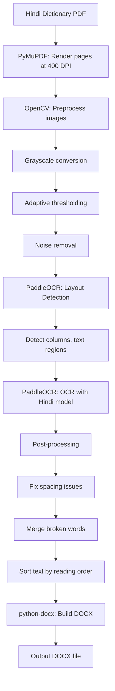

# Hindi PDF Dictionary → DOCX Converter (CLI)

A command-line tool to convert Hindi scientific/technical dictionary PDFs to DOCX with high accuracy, using OCR to bypass broken font encodings.

## Goal

Convert your Hindi dictionary PDF (which has no extractable text layer) into a structured DOCX file, preserving the tabular entry format. This CLI tool will test OCR accuracy before building a full web app.

## Architecture



---

## Sample PDF Analysis

Analyzed `sample_dictionary.pdf` (10 pages, 540×780 pt). **The PDF text layer is completely empty** — all content is only in the rendered image, confirming OCR is the correct approach.

### Layout Structure

- **2-column layout** with a visible vertical separator line down the center
- **Page headers**: Running header with first entry word (left), page number (center), last entry word (right)
- **No images or figures** — purely text content

### Entry Structure (Critical Finding)

Each dictionary entry is **tabular with 3 sub-columns** within each main column:

| Sub-column | Content | Formatting |
|------------|---------|------------|
| 1 (left) | English headword | **Bold** |
| 2 (middle) | Subject abbreviation(s) | *Italic* (e.g., *Mth*, *Phy, Ch*) |
| 3 (right) | Hindi translation(s) | Regular weight, Devanagari script |

### Known Subject Abbreviations

`Mth` (Mathematics), `Phy` (Physics), `Ch` (Chemistry), `Bot` (Botany), `Env` (Environment), `Gg` (Geography), `Gl` (Geology), `HS` (Health Science), `Zl` (Zoology), `Met` (Meteorology)

### Special Cases

- **Multi-line entries**: Some headwords span 2 lines (e.g., "absolute value valuation")
- **Multiple subjects**: Some entries list several subject codes on separate lines (e.g., "Ch, Phy, HS, Bot, Gl")
- **Numbered translations**: Some entries have multiple Hindi meanings numbered "1. ... 2. ..."
- **Parenthetical notes**: Some entries include notes like "(= transmission curve)", "(= detergent)"
- **Hyphenated Hindi**: Some translations use hyphens (e.g., "अवशोषण-गुणांक")

---

## Open Questions

> [!IMPORTANT]
> **Do you have a GPU (NVIDIA)?** PaddleOCR runs on CPU but is significantly faster on GPU. The tool will work either way, but GPU speeds up processing of large dictionaries.

---

## Proposed Changes

### Project Structure

```
C:\Users\vishn\OneDrive\Desktop\PDF-TO-DOCX\
├── convert.py              # Main CLI entry point
├── pipeline/
│   ├── __init__.py
│   ├── renderer.py         # PDF → high-res images (PyMuPDF)
│   ├── preprocessor.py     # Image cleanup (OpenCV)
│   ├── ocr_engine.py       # PaddleOCR wrapper (Hindi + English)
│   ├── layout_analyzer.py  # Column detection, entry parsing & reading order
│   ├── postprocessor.py    # Text cleanup, spacing fixes, abbreviation validation
│   └── docx_builder.py     # DOCX table reconstruction (python-docx)
├── requirements.txt        # Python dependencies
└── README.md               # Setup & usage instructions
```

---

### CLI Entry Point

#### [NEW] [convert.py](file:///C:/Users/vishn/.gemini/antigravity/scratch/pdf-to-docx/convert.py)

Command-line interface with:

```
Usage:
  python convert.py input.pdf                    # → input.docx
  python convert.py input.pdf -o output.docx     # → output.docx
  python convert.py input.pdf --dpi 400          # Higher DPI for tiny text
  python convert.py input.pdf --pages 1-5        # Convert only pages 1-5
  python convert.py input.pdf --debug            # Save intermediate images for inspection
```

| Argument | Default | Purpose |
|----------|---------|---------|
| `input` | Required | Path to input PDF |
| `-o, --output` | `<input>.docx` | Output DOCX path |
| `--dpi` | `400` | Render DPI (higher = better accuracy, slower) |
| `--pages` | All | Page range to convert (e.g., `1-5` or `3,7,12`) |
| `--lang` | `hi,en` | OCR languages (Hindi + English) |
| `--debug` | Off | Save preprocessed images and OCR visualization to a `debug/` folder |
| `--columns` | Auto-detect | Force column count (1, 2, or 3) if auto-detection fails |

Flow:
1. Parse arguments, validate input PDF exists
2. For each page: render → preprocess → detect layout → OCR → collect results
3. Post-process all text results
4. Build DOCX from processed results
5. Print summary stats (pages processed, text extracted, confidence scores)

---

### Pipeline Modules

#### [NEW] [renderer.py](file:///C:/Users/vishn/.gemini/antigravity/scratch/pdf-to-docx/pipeline/renderer.py)

Renders each PDF page to a high-resolution image using PyMuPDF.

- Render at **400 DPI** (higher than standard 300 to handle tiny dictionary text)
- Output as numpy arrays (for OpenCV processing) and PIL Images (for PaddleOCR)
- Report page dimensions and estimated text density

---

#### [NEW] [preprocessor.py](file:///C:/Users/vishn/.gemini/antigravity/scratch/pdf-to-docx/pipeline/preprocessor.py)

Image preprocessing pipeline to maximize OCR accuracy:

| Step | What It Does | Why It Helps |
|------|-------------|--------------|
| Grayscale conversion | Convert RGB → grayscale | Reduces noise, faster processing |
| Adaptive thresholding | Binarize with local thresholds | Handles uneven lighting/backgrounds |
| Noise removal | Morphological opening (small kernel) | Removes speckles that confuse OCR |
| Deskewing | Detect and correct page rotation | Misalignment drops accuracy significantly |
| Border removal | Crop black borders if present | Prevents OCR from reading border artifacts |
| Contrast enhancement | CLAHE (Contrast Limited Adaptive Histogram Equalization) | Improves faint text visibility |

Each step is optional and configurable. In `--debug` mode, saves the image after each step for visual inspection.

---

#### [NEW] [layout_analyzer.py](file:///C:/Users/vishn/OneDrive/Desktop/PDF-TO-DOCX/pipeline/layout_analyzer.py)

Detects the layout structure of each page and parses the tabular entry format.

**Phase 1: Column Detection**

1. Detect the vertical separator line using edge detection (Canny) or vertical line detection (HoughLinesP)
2. Fallback: Project all detected text bounding boxes onto the X-axis, find the largest gap → column separator
3. Split page into left column and right column regions

**Phase 2: Page Header Extraction**

1. Identify top-of-page text (first ~5% of page height)
2. Extract: left header word, page number (center), right header word
3. These can be preserved as DOCX headers or omitted

**Phase 3: Entry Parsing (per column)**

Within each column, detect the 3 sub-column structure:

1. Group OCR text boxes by Y-coordinate proximity → entry rows
2. Within each row, classify boxes by X-position:
   - **Left third** → English headword
   - **Middle** → Subject abbreviation(s)
   - **Right third** → Hindi translation
3. Handle multi-line entries by merging consecutive rows with no new headword
4. Validate subject abbreviations against the known list (`Mth`, `Phy`, `Ch`, etc.)

This handles:
- 2-column dictionary layout with vertical separator
- Multi-line headwords and subject fields
- Entries with multiple numbered translations
- Page headers

---

#### [NEW] [ocr_engine.py](file:///C:/Users/vishn/.gemini/antigravity/scratch/pdf-to-docx/pipeline/ocr_engine.py)

PaddleOCR wrapper configured for Hindi dictionary text.

```python
from paddleocr import PaddleOCR

ocr = PaddleOCR(
    lang='hi',              # Hindi (Devanagari) model
    use_angle_cls=True,     # Detect rotated text
    show_log=False,
    use_gpu=False,          # Set True if GPU available
    det_db_thresh=0.3,      # Lower threshold to catch small text
    det_db_unclip_ratio=1.8 # Slightly expand detection boxes
)
```

For each text region detected by layout analyzer:
1. Crop the region from the preprocessed image
2. Run PaddleOCR on the cropped region
3. Collect: `text`, `confidence`, `bounding_box` for each detected line
4. Flag low-confidence results (< 0.7) for the summary report

For mixed Hindi+English: run PaddleOCR twice — once with `lang='hi'` and once with `lang='en'` — then merge results based on script detection (Unicode range check: Devanagari = U+0900–U+097F).

---

#### [NEW] [postprocessor.py](file:///C:/Users/vishn/OneDrive/Desktop/PDF-TO-DOCX/pipeline/postprocessor.py)

Cleans up raw OCR output to fix common issues:

| Fix | What It Does |
|-----|-------------|
| **Merge broken words** | Join words split across detection boxes (e.g., "dic" + "tionary" → "dictionary") |
| **Fix Hindi spacing** | Remove incorrect spaces inserted mid-word (e.g., "शब् दकोश" → "शब्दकोश") |
| **Normalize Unicode** | Apply NFC normalization to Devanagari (combine separate matra + consonant into single character) |
| **Remove duplicate detections** | Deduplicate overlapping text regions |
| **Fix punctuation spacing** | Ensure proper spacing around punctuation marks |
| **Validate subject abbreviations** | Match OCR'd abbreviations against the known set (Mth, Phy, Ch, Bot, Env, Gg, Gl, HS, Zl, Met) and correct common OCR misreads (e.g., "Mfh" → "Mth") |
| **Merge numbered translations** | Combine "1. xxx" and "2. yyy" into a single cell with line breaks |
| **Handle parenthetical notes** | Preserve notes like "(= transmission curve)" attached to the correct entry |

---

#### [NEW] [docx_builder.py](file:///C:/Users/vishn/OneDrive/Desktop/PDF-TO-DOCX/pipeline/docx_builder.py)

Builds the output DOCX from processed OCR results as a **structured Word table**.

For each page:
1. Add a page break (except first page)
2. Optionally add page header (running header text + page number)
3. Create a **3-column Word table** with columns:
   - Column 1: English headword (**bold**, font: Arial 10pt)
   - Column 2: Subject abbreviation (*italic*, font: Arial 9pt)
   - Column 3: Hindi translation (font: Mangal 10pt)
4. Each dictionary entry = one table row
5. Multi-line entries: merged into a single cell with line breaks
6. Numbered translations: preserved as "1. xxx\n2. yyy" within the cell
7. Table styling:
   - Light gray borders between rows
   - No outer border (clean look)
   - Column widths proportional to content (approx 35% / 15% / 50%)
8. In `--debug` mode: embed the original page image above each page's table for comparison

> [!NOTE]
> The table output faithfully preserves the source dictionary's structure. This makes the DOCX directly usable as a reference, not just an accuracy test.

---

### Configuration & Dependencies

#### [NEW] [requirements.txt](file:///C:/Users/vishn/.gemini/antigravity/scratch/pdf-to-docx/requirements.txt)

```
paddlepaddle          # PaddlePaddle deep learning framework (CPU version)
paddleocr             # PaddleOCR with Hindi model
pymupdf               # PDF rendering
python-docx           # DOCX creation
opencv-python         # Image preprocessing
numpy                 # Array operations
Pillow                # Image handling
```

> [!WARNING]
> **`paddlepaddle` is ~150MB+ download.** First install may take a few minutes. GPU version (`paddlepaddle-gpu`) requires CUDA toolkit.

---

#### [NEW] [README.md](file:///C:/Users/vishn/.gemini/antigravity/scratch/pdf-to-docx/README.md)

Setup and usage guide:

```
# Installation
pip install paddlepaddle paddleocr pymupdf python-docx opencv-python numpy Pillow

# Basic usage
python convert.py dictionary.pdf

# With options
python convert.py dictionary.pdf -o output.docx --dpi 400 --pages 1-5 --debug

# Force 2-column layout
python convert.py dictionary.pdf --columns 2
```

---

## Verification Plan

### Test 1: Installation Check
```bash
cd C:\Users\vishn\OneDrive\Desktop\PDF-TO-DOCX
pip install -r requirements.txt
python -c "from paddleocr import PaddleOCR; print('PaddleOCR ready')"
```

### Test 2: Convert First 3 Pages of Sample
```bash
python convert.py sample_dictionary.pdf --pages 1-3 --debug -o test_output.docx
```
- Check `test_output.docx` — verify the 3-column table is correctly structured
- Check `debug/` folder for preprocessed images and OCR visualization
- Compare against the original PDF images

### Test 3: Accuracy Assessment (against known content from sample)
Manually spot-check these entries from page 1 (page 9 in dictionary):
- [ ] "absolute value valuation" → *Mth* → "निरपेक्ष मान मानांकन"
- [ ] "absorbable" → *HS, Ch, Bot* → "अवशोष्य"
- [ ] "absorbency" → *HS, Ch* → "1. अवशोषणांक 2. अवशोषकता" (numbered translations)
- [ ] Column reading order: left column entries before right column entries
- [ ] Subject abbreviations: correctly parsed and italicized
- [ ] Hindi spacing: no broken words (e.g., "अवशोषण" not "अव शोषण")

### Test 4: Full 10-Page Sample
```bash
python convert.py sample_dictionary.pdf -o full_output.docx
```
- Verify all 10 pages convert without errors
- Check that page headers are handled correctly
- Confirm entry count matches visual inspection
